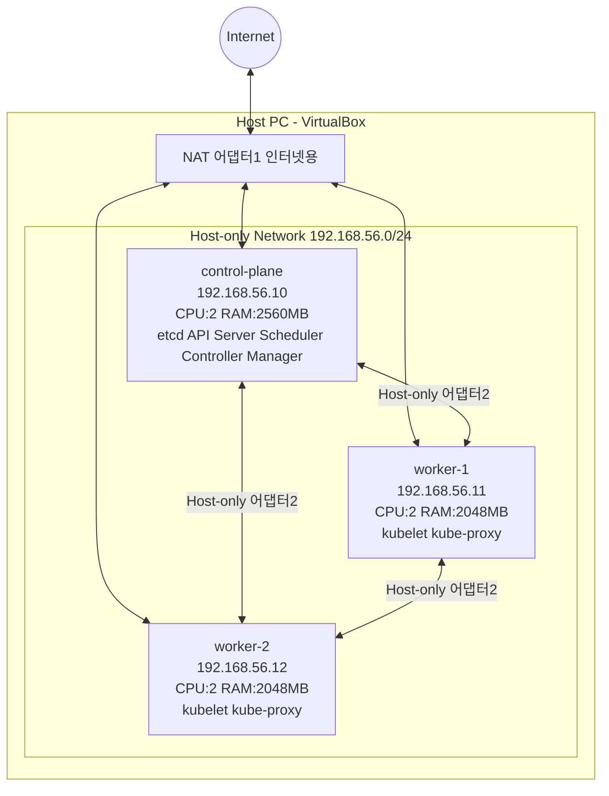

# VirtualBox + 쿠버네티스 구축하기

VirtualBox로 **control-plane 1대 + worker 2대** 구성하기

스킬샵 클러스터를 내 PC에 그대로 만들어봅니다.

**Kubernetes v1.32 / Ubuntu 22.04 LTS / containerd / Cilium 기준**

---

## 클러스터 구성도



---

## 목차

1. [사전 준비](#1-사전-준비)
2. [Ubuntu 이미지 다운로드 & 저장 위치](#2-ubuntu-이미지-다운로드-저장-위치)
3. [control-plane VM 생성 및 설정 (복제 전)](#3-control-plane-vm-생성-및-설정-복제-전)
4. [worker VM 복제 및 설정](#4-worker-vm-복제-및-설정)
5. [공통 설정 (3대 모두)](#5-공통-설정-3대-모두)
6. [control-plane 초기화](#6-control-plane-초기화)
7. [Cilium 설치](#7-cilium-설치)
8. [worker 노드 조인](#8-worker-노드-조인)
9. [최종 검증](#9-최종-검증)
10. [자주 나는 에러 & 트러블슈팅](#10-자주-나는-에러-트러블슈팅)

---

## 1. 사전 준비

### 내 PC 최소 사양

VM 3대를 동시에 돌리므로 호스트 PC 사양이 중요합니다.

| 항목 | 최소 | 권장 |
|------|------|------|
| CPU | 4코어 | 6코어 이상 |
| RAM | 8GB | 16GB 이상 |
| 디스크 여유 | 50GB | 80GB 이상 |

!!! warning
    RAM 8GB면 빠듯합니다. 다른 프로그램 다 끄고 진행하세요.

### VM 1대당 할당 사양

| VM | CPU | RAM | 디스크 |
|----|-----|-----|--------|
| control-plane | 2 | 2.5GB (2560MB) | 20GB |
| worker-1 | 2 | 2GB (2048MB) | 20GB |
| worker-2 | 2 | 2GB (2048MB) | 20GB |

!!! info
    control-plane은 etcd/apiserver가 돌아서 RAM을 조금 더 줍니다.
    RAM이 부족하면 worker를 1대만 만들어도 실습은 됩니다.

### VirtualBox 설치

1. [https://www.virtualbox.org/wiki/Downloads](https://www.virtualbox.org/wiki/Downloads) 접속
2. 본인 OS용 설치 (Windows host / macOS host)
3. Extension Pack도 같이 설치 (USB, 네트워크 기능 확장)

!!! warning "Apple Silicon 주의"
    Apple Silicon(M1/M2/M3) 맥은 VirtualBox 지원이 제한적입니다.
    이 경우 **UTM** 또는 **Multipass** 사용을 고려하세요. (별도 안내)

---

## 2. Ubuntu 이미지 다운로드 & 저장 위치

### 어떤 이미지를 받나

- **Ubuntu Server 22.04 LTS** (Desktop 아님, Server!)
- 파일명 예: `ubuntu-22.04.5-live-server-amd64.iso`
- 다운로드: [https://releases.ubuntu.com/22.04/](https://releases.ubuntu.com/22.04/)

!!! warning
    Desktop 버전은 GUI 때문에 무겁습니다. 반드시 Server 버전.
    Apple Silicon 맥이면 arm64 버전을 받으세요.

### ISO 파일을 어디에 저장하나

ISO는 VM "설치 디스크" 역할만 합니다. 한 번 설치하면 그 뒤엔 거의 안 씁니다.

=== "Windows"
    ```
    C:\Users\<사용자명>\VirtualBox VMs\iso\
      └── ubuntu-22.04.5-live-server-amd64.iso
    ```

=== "macOS"
    ```
    ~/VirtualBox VMs/iso/
      └── ubuntu-22.04.5-live-server-amd64.iso
    ```

!!! tip
    VM 디스크 파일(.vdi)과 ISO를 같은 상위 폴더 아래 두면 관리가 편합니다.
    ISO는 3대 VM이 공유해서 쓰므로 한 곳에 두고 3번 마운트하면 됩니다.

### VM 디스크(.vdi)는 어디에 저장되나

VirtualBox가 자동으로 아래에 만듭니다 (기본값).

=== "Windows"
    ```
    C:\Users\<사용자명>\VirtualBox VMs\<VM이름>\
    ```

=== "macOS"
    ```
    ~/VirtualBox VMs/<VM이름>/
    ```

!!! tip
    디스크 여유가 부족하면 VirtualBox 환경설정 > 일반 > "기본 머신 폴더"를 외장 SSD 등으로 바꿀 수 있습니다.

---

## 3. control-plane VM 생성 및 설정 (복제 전)

!!! warning "중요"
    이 섹션의 모든 설정은 **복제 전에 완료**해야 합니다.
    control-plane을 복제해서 worker-1, worker-2를 만들기 때문에, 여기서 설정한 내용이 세 대에 그대로 복사됩니다.

### 3-1. VM 생성

1. VirtualBox > 새로 만들기(New)
2. 이름: `control-plane`
3. ISO 이미지: 위에서 받은 ubuntu server iso 선택
4. "Skip Unattended Installation" 체크 (수동 설치 위해)
5. 메모리: `2560MB`, CPU: `2`
6. 디스크: `20GB` (동적 할당)
7. 생성 완료

!!! warning
    2560MB 이상을 권장합니다. 그 이하(특히 2GB 미만)로 설정하면 control-plane에서 etcd, API Server, Scheduler, Controller Manager가 동시에 기동될 때 메모리 부족(OOM)이 발생하여 클러스터가 정상적으로 동작하지 않을 수 있습니다.

### 3-2. 부팅 확인 & OpenSSH Server 설치

이 실습에서는 사전 구성된 ISO를 사용하므로 별도 설치 과정 없이 부팅하면 바로 로그인 화면이 나타납니다.

부팅 후 아래 항목을 확인하세요.

```bash
hostname
whoami
ip a
```

OpenSSH Server 설치 (SSH 접속용):

```bash
sudo apt-get update
sudo apt-get install -y openssh-server
sudo systemctl enable ssh
sudo systemctl start ssh
sudo systemctl status ssh --no-pager
```

### 3-3. VirtualBox 호스트 전용 네트워크 & 어댑터 설정

노드끼리 통신하려면 고정 IP가 필요합니다. 어댑터를 2개 붙입니다: **NAT(인터넷용) + 호스트 전용(노드 간 통신용)**.

**호스트 전용 네트워크 만들기 (VirtualBox UI에서):**

1. VirtualBox 메인 화면 > 도구(Tools) > 네트워크(Network)
2. Host-only Networks 탭 > 생성(Create)
3. 만들어진 네트워크 확인 (예: `vboxnet0`, IP 대역 `192.168.56.x`)
4. 이 대역(`192.168.56.0/24`)을 노드 IP에 씁니다.

**control-plane VM에 어댑터 2개 설정 (VM 종료 상태에서):**

- VM > 설정(Settings) > 네트워크(Network)
- 어댑터 1: **NAT** (인터넷 연결용)
- 어댑터 2: **호스트 전용 어댑터** (vboxnet0, 노드 간 통신용)

!!! tip
    복제 시 이 어댑터 설정이 그대로 복사되므로 여기서 한 번만 하면 됩니다.

### 3-4. 고정 IP 설정 (netplan)

이 가이드에서 쓸 IP:

| 노드 | 고정 IP |
|------|---------|
| control-plane | `192.168.56.10` |
| worker-1 | `192.168.56.11` |
| worker-2 | `192.168.56.12` |

netplan 설정 파일(`/etc/netplan/00-installer-config.yaml`)을 열어 작성합니다.

- 어댑터1(NAT): `dhcp4: true`
- 어댑터2(호스트전용): `dhcp4: false`에 고정 IP 지정

!!! info
    인터페이스 이름은 `ip a`로 실제 확인하세요. 환경마다 다를 수 있습니다.

```bash
sudo netplan apply
```

### 3-5. 호스트명 등록

hosts 파일에 세 노드의 IP와 호스트명을 등록합니다.

!!! tip
    복제 시 이 파일도 그대로 복사되므로 worker에서 따로 설정할 필요가 없습니다.

### 3-6. VM 종료

```bash
sudo poweroff
```

!!! warning "복제 전 필수 확인"
    VirtualBox에서 VM 상태가 **"전원 꺼짐(Powered Off)"** 인지 반드시 확인하세요.
    저장된 상태(Saved)나 일시 중단(Paused) 상태에서는 복제가 정상적으로 되지 않습니다.

---

## 4. worker VM 복제 및 설정

### 4-1. 복제 (clone)

control-plane VM이 Powered Off 상태인지 확인 후:

1. control-plane VM 우클릭 > 복제(Clone)
2. 이름: `worker-1`
3. **"모든 네트워크 카드 MAC 주소 새로 생성"** 선택 (중요! 안 하면 IP 충돌)
4. **"완전한 복제(Full Clone)"** 선택
5. 같은 방법으로 `worker-2`도 복제

!!! tip
    어댑터 설정, netplan 구조, hosts 설정이 모두 복사됩니다.
    worker에서 바꿔야 하는 건 **IP 주소와 hostname 두 가지뿐**입니다.

### 4-2. worker별 IP 변경 및 hostname 설정

worker-1, worker-2 각각 부팅 후 아래를 실행합니다.

netplan 설정 파일에서 IP 한 줄만 수정:

- worker-1: `192.168.56.11/24`
- worker-2: `192.168.56.12/24`

```bash
sudo netplan apply
ip a | grep 192.168.56
```

hostname 변경 (worker-1):

```bash
sudo hostnamectl set-hostname worker-1
exec bash
```

!!! info
    worker-2에서는 `worker-2`로 설정합니다.

### 4-3. 통신 확인 (필수 체크포인트)

3대 모두 부팅된 상태에서 **control-plane에서** 실행:

```bash
ping -c 2 worker-1
ping -c 2 worker-2
```

!!! success "체크포인트"
    ping이 가야 다음으로 진행하세요. 안 가면 netplan IP 설정을 다시 점검하세요.

---

## 5. 공통 설정 (3대 모두)

control-plane, worker-1, worker-2 **세 대 모두**에서 동일하게 실행합니다.

### 5-1. swap 비활성화

```bash
sudo swapoff -a
sudo sed -i.bak -r 's/(.+ swap .+)/#\1/' /etc/fstab
free -h
```

!!! warning
    swap이 살아있으면 `kubeadm init`이 실패합니다. Swap 항목이 `0`이어야 합니다.

### 5-2. 커널 모듈 & sysctl

```bash
sudo tee /etc/modules-load.d/k8s.conf <<EOF
overlay
br_netfilter
EOF

sudo modprobe overlay
sudo modprobe br_netfilter

sudo tee /etc/sysctl.d/kubernetes.conf <<EOF
net.bridge.bridge-nf-call-ip6tables = 1
net.bridge.bridge-nf-call-iptables = 1
net.ipv4.ip_forward = 1
EOF

sudo sysctl --system
```

### 5-3. containerd 설치

```bash
sudo apt-get update
sudo apt-get install -y containerd

sudo mkdir -p /etc/containerd
containerd config default | sudo tee /etc/containerd/config.toml > /dev/null

sudo sed -i 's/SystemdCgroup = false/SystemdCgroup = true/g' /etc/containerd/config.toml

sudo systemctl restart containerd
sudo systemctl enable containerd
sudo systemctl status containerd --no-pager
```

!!! warning
    `SystemdCgroup = true` 안 바꾸면 나중에 kubelet이 불안정합니다.

### 5-4. kubeadm / kubelet / kubectl 설치 (v1.32)

```bash
sudo apt-get update
sudo apt-get install -y apt-transport-https ca-certificates curl gpg

sudo mkdir -p -m 755 /etc/apt/keyrings

curl -fsSL https://pkgs.k8s.io/core:/stable:/v1.32/deb/Release.key | \
  sudo gpg --dearmor -o /etc/apt/keyrings/kubernetes-apt-keyring.gpg

echo "deb [signed-by=/etc/apt/keyrings/kubernetes-apt-keyring.gpg] \
https://pkgs.k8s.io/core:/stable:/v1.32/deb/ /" | \
  sudo tee /etc/apt/sources.list.d/kubernetes.list

sudo apt-get update
sudo apt-get install -y kubelet kubeadm kubectl
sudo apt-mark hold kubelet kubeadm kubectl

kubeadm version
```

!!! success "체크포인트"
    여기까지가 3대 공통입니다. 세 대 모두 5-1 ~ 5-4 완료 후 6번으로 넘어가세요.

### worker용 한번에 설치 블록

control-plane에서는 위 5-1 ~ 5-4를 하나씩 따라가세요.
worker-1, worker-2는 아래 블록을 통째로 복사해서 붙여넣기 하면 한 번에 설치됩니다.

```bash
sudo swapoff -a
sudo sed -i.bak -r 's/(.+ swap .+)/#\1/' /etc/fstab

sudo tee /etc/modules-load.d/k8s.conf <<EOF
overlay
br_netfilter
EOF
sudo modprobe overlay
sudo modprobe br_netfilter

sudo tee /etc/sysctl.d/kubernetes.conf <<EOF
net.bridge.bridge-nf-call-ip6tables = 1
net.bridge.bridge-nf-call-iptables = 1
net.ipv4.ip_forward = 1
EOF
sudo sysctl --system

sudo apt-get update
sudo apt-get install -y containerd
sudo mkdir -p /etc/containerd
containerd config default | sudo tee /etc/containerd/config.toml > /dev/null
sudo sed -i 's/SystemdCgroup = false/SystemdCgroup = true/g' /etc/containerd/config.toml
sudo systemctl restart containerd
sudo systemctl enable containerd

sudo apt-get install -y apt-transport-https ca-certificates curl gpg
sudo mkdir -p -m 755 /etc/apt/keyrings
curl -fsSL https://pkgs.k8s.io/core:/stable:/v1.32/deb/Release.key | \
  sudo gpg --dearmor -o /etc/apt/keyrings/kubernetes-apt-keyring.gpg
echo "deb [signed-by=/etc/apt/keyrings/kubernetes-apt-keyring.gpg] \
https://pkgs.k8s.io/core:/stable:/v1.32/deb/ /" | \
  sudo tee /etc/apt/sources.list.d/kubernetes.list
sudo apt-get update
sudo apt-get install -y kubelet kubeadm kubectl
sudo apt-mark hold kubelet kubeadm kubectl

echo "완료! kubeadm version으로 확인하세요."
kubeadm version
```

---

## 6. control-plane 초기화

!!! warning
    **control-plane VM에서만** 실행합니다.

```bash
sudo kubeadm init \
  --apiserver-advertise-address=192.168.56.10 \
  --pod-network-cidr=10.244.0.0/16
```

성공하면 마지막에 join 명령어가 출력됩니다.

```bash
kubeadm join 192.168.56.10:6443 --token xxxx \
  --discovery-token-ca-cert-hash sha256:yyyy
```

!!! warning "중요"
    이 join 명령어를 메모장에 꼭 복사하세요! 8번에서 씁니다.

kubeconfig 설정 (control-plane):

```bash
mkdir -p $HOME/.kube
sudo cp -i /etc/kubernetes/admin.conf $HOME/.kube/config
sudo chown $(id -u):$(id -g) $HOME/.kube/config

kubectl get nodes
```

!!! info
    `NotReady`는 정상입니다. 다음 7번에서 Cilium을 설치하면 `Ready`가 됩니다.

---

## 7. Cilium 설치

control-plane에서만 실행합니다.

```bash
CILIUM_CLI_VERSION=$(curl -s https://raw.githubusercontent.com/cilium/cilium-cli/main/stable.txt)
CLI_ARCH=$(dpkg --print-architecture)
curl -L --fail --remote-name-all \
  https://github.com/cilium/cilium-cli/releases/download/${CILIUM_CLI_VERSION}/cilium-linux-${CLI_ARCH}.tar.gz
sudo tar xzvfC cilium-linux-${CLI_ARCH}.tar.gz /usr/local/bin
rm cilium-linux-${CLI_ARCH}.tar.gz

cilium install
cilium status --wait
```

확인:

```bash
kubectl get nodes
kubectl get pods -n kube-system | grep cilium
```

!!! success "체크포인트"
    control-plane이 `Ready`면 성공입니다.

---

## 8. worker 노드 조인

!!! warning
    **worker-1, worker-2 각각**에서 실행합니다.

6번에서 복사해둔 join 명령어를 `sudo` 붙여서 실행:

```bash
sudo kubeadm join 192.168.56.10:6443 --token xxxx \
  --discovery-token-ca-cert-hash sha256:yyyy
```

!!! tip "토큰을 잃어버렸거나 24시간이 지났다면"
    control-plane에서 재발급:
    ```bash
    kubeadm token create --print-join-command
    ```

---

## 9. 최종 검증

control-plane에서 실행합니다.

```bash
kubectl get nodes
kubectl get nodes -o wide
```

기대 결과:

```
NAME            STATUS   ROLES           AGE   VERSION
control-plane   Ready    control-plane   10m   v1.32.x
worker-1        Ready    <none>          3m    v1.32.x
worker-2        Ready    <none>          2m    v1.32.x
```

테스트 Pod 배포 (선택):

```bash
kubectl create deployment test --image=nginx
kubectl get pods -o wide
kubectl delete deployment test
```

!!! success "구축 완료"
    3대 모두 `Ready` + 테스트 Pod `Running`이면 구축 완료입니다.
    이제 스킬샵 클러스터가 내 PC에 살아있습니다.

---

## 10. 자주 나는 에러 & 트러블슈팅

| 증상 | 확인 사항 |
|------|---------|
| kubeadm init 실패 | RAM 부족 여부, containerd 상태 확인 |
| worker join 안됨 | control-plane ping 확인, 토큰 만료(24h), sudo 여부, swap/방화벽 |
| 노드 계속 NotReady | cilium pod 상태 확인, kubelet 로그 확인 |
| 노드 간 통신 안됨 | 어댑터2 호스트전용 여부, netplan IP, ping 테스트, hosts 파일 |

### kubeadm init이 실패해요

```bash
free -h
sudo systemctl status containerd
sudo kubeadm reset -f
sudo rm -rf $HOME/.kube
```

### worker join이 안 돼요

- control-plane으로 ping이 가는가? (4-3 확인)
- 토큰 만료 아닌가? (24시간) → 재발급
- join에 `sudo` 붙였는가?
- 양쪽 방화벽/swap 확인

### 노드가 계속 NotReady예요

```bash
kubectl get pods -n kube-system | grep cilium
sudo journalctl -u kubelet -f
```

### 노드 간 통신이 안 돼요 (가장 흔함)

원인: 호스트 전용 네트워크 설정 문제

- 각 VM 어댑터2가 호스트전용인지 확인
- netplan IP가 제대로 들어갔는지 (`ip a`)
- `ping 192.168.56.10` 테스트
- hosts 파일 등록 확인

### 처음부터 다시 하고 싶어요

```bash
sudo kubeadm reset -f
sudo rm -rf $HOME/.kube
sudo iptables -F && sudo iptables -t nat -F
```

그 후 6번부터 다시 시작합니다.
