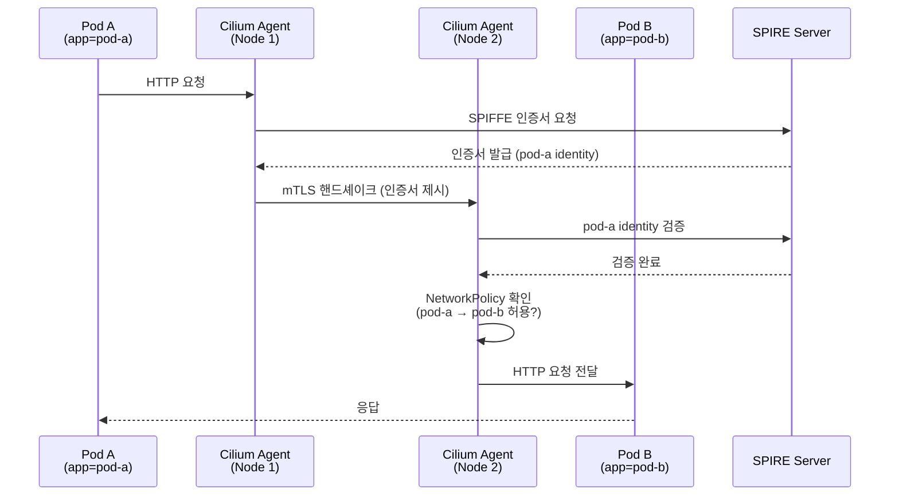

# NetworkPolicy 06 — Cilium Mutual TLS (mTLS)

## 실습 목표

- Cilium의 **Transparent Encryption** (WireGuard / IPsec) 개념을 이해한다.
- **mTLS**가 왜 필요한지, 기존 NetworkPolicy와 무엇이 다른지 이해한다.
- Cilium mTLS를 활성화하고 Pod 간 암호화 통신을 검증한다.
- `authentication.mode: required`로 인증되지 않은 통신을 차단한다.

---

## 개념

### NetworkPolicy만으로 부족한 이유

표준 NetworkPolicy는 **IP/포트 기반 접근 제어**입니다.
하지만 다음 상황은 막지 못합니다.

```
공격자가 Pod IP를 스푸핑 → NetworkPolicy 우회 가능 ⚠️
트래픽이 평문으로 이동  → 스니핑 가능 ⚠️
```

### mTLS가 해결하는 것

```
일반 TLS:   클라이언트가 서버 인증서 검증
mTLS:       클라이언트 ↔ 서버 서로 인증서 검증 (Mutual = 상호)

Pod A ──[암호화 + 상호 인증]──▶ Pod B
        ↑
  Cilium이 자동으로 처리
  (앱 코드 수정 없음)
```

### Cilium의 두 가지 암호화 방식

| 방식 | 레이어 | 특징 |
|------|--------|------|
| **WireGuard** | L3 (IP) | 빠름, 커널 내장, Cilium 1.10+ |
| **IPsec** | L3 (IP) | 표준, 더 광범위 호환 |

Cilium 1.14+에서는 **mTLS at L7** (SPIFFE/SPIRE 기반) 도 지원합니다.

---

## Part A — Transparent Encryption (WireGuard)

노드 간 모든 트래픽을 WireGuard로 암호화합니다.

### WireGuard 활성화

```bash
# Helm으로 WireGuard 활성화 (기존 Cilium 업그레이드)
helm upgrade cilium cilium/cilium \
  --namespace kube-system \
  --reuse-values \
  --set encryption.enabled=true \
  --set encryption.type=wireguard

# 또는 kind 클러스터 새로 생성 시:
helm install cilium cilium/cilium \
  --namespace kube-system \
  --set encryption.enabled=true \
  --set encryption.type=wireguard \
  --set image.pullPolicy=IfNotPresent \
  --set ipam.mode=kubernetes

# Cilium 재시작 대기
kubectl rollout status daemonset/cilium -n kube-system
```

### WireGuard 상태 확인

```bash
# 각 노드의 Cilium에서 WireGuard 상태 확인
kubectl exec -n kube-system \
  $(kubectl get pods -n kube-system -l k8s-app=cilium -o jsonpath='{.items[0].metadata.name}') \
  -- cilium encrypt status
```

```
Encryption:            Wireguard
Wireguard:
  NodeEncryption:  Disabled
  Interface: cilium_wg0
    Public key: xxxxxxxxxxxxxxxxxxxxxxxxxxxxxxxxxxxxx=
    Peers:
      ...
```

### 암호화 트래픽 검증

```bash
# 테스트 Pod 배포
kubectl create namespace mtls-demo

kubectl run pod-a \
  --image=curlimages/curl:latest \
  --namespace=mtls-demo \
  --labels="app=pod-a" \
  --command -- sleep infinity

kubectl run pod-b \
  --image=nginx:alpine \
  --namespace=mtls-demo \
  --labels="app=pod-b"

kubectl expose pod pod-b --port=80 --name=pod-b-svc --namespace=mtls-demo

# 통신 테스트
kubectl exec -n mtls-demo pod-a -- \
  curl -s http://pod-b-svc.mtls-demo.svc.cluster.local | head -3
```

```bash
# 노드에서 tcpdump로 암호화 확인 (kind 환경)
kubectl debug node/cilium-lab-worker -it --image=nicolaka/netshoot -- \
  tcpdump -i eth0 -n 'udp port 51871' -c 10
```

WireGuard 포트(51871)로 암호화된 UDP 패킷이 보입니다. 평문 HTTP가 아닙니다. ✅

---

## Part B — Cilium mTLS (SPIFFE/SPIRE Identity)

Cilium 1.14+에서는 **Pod Identity 기반 mTLS**를 지원합니다.
각 Pod에 SPIFFE ID가 부여되고, 통신 시 인증서로 상호 인증합니다.

### mTLS 활성화

```bash
helm upgrade cilium cilium/cilium \
  --namespace kube-system \
  --reuse-values \
  --set authentication.mutual.spire.enabled=true \
  --set authentication.mutual.spire.install.enabled=true

# SPIRE 컴포넌트 배포 확인
kubectl get pods -n cilium-spire
```

```
NAME                    READY   STATUS    AGE
spire-agent-xxxxx       1/1     Running   60s
spire-server-0          1/1     Running   60s
```

### SPIFFE ID 확인

```bash
# Pod에 부여된 SPIFFE ID 확인
kubectl exec -n kube-system \
  $(kubectl get pods -n kube-system -l k8s-app=cilium -o jsonpath='{.items[0].metadata.name}') \
  -- cilium identity list
```

각 Pod는 다음 형식의 SPIFFE ID를 갖습니다:

```
spiffe://cluster.local/ns/mtls-demo/sa/default
```

---

## Part C — authentication.mode: required

이것이 핵심입니다. **인증된 연결만 허용**하는 정책입니다.

### mTLS 필수 정책 적용

```yaml title="mtls-required.yaml"
apiVersion: "cilium.io/v2"
kind: CiliumNetworkPolicy
metadata:
  name: mtls-required
  namespace: mtls-demo
spec:
  endpointSelector:
    matchLabels:
      app: pod-b             # pod-b에 들어오는 트래픽에 적용
  ingress:
    - fromEndpoints:
        - matchLabels:
            app: pod-a       # pod-a에서 오는 트래픽만 허용
      authentication:
        mode: "required"     # mTLS 인증 필수!
      toPorts:
        - ports:
            - port: "80"
              protocol: TCP
```

```bash
kubectl apply -f mtls-required.yaml
```

### 검증 — 인증된 Pod vs 미인증 Pod

```bash
# pod-a (Cilium identity 있음) → 허용 ✅
kubectl exec -n mtls-demo pod-a -- \
  curl -s --connect-timeout 3 http://pod-b-svc.mtls-demo.svc.cluster.local | head -3

# 외부에서 온 것처럼 보이는 요청 → 차단 🚫
# (mTLS 인증 없이 들어오는 트래픽은 Cilium이 드롭)
kubectl run attacker \
  --image=curlimages/curl:latest \
  --namespace=default \
  --labels="app=attacker" \
  --command -- sleep infinity

kubectl exec attacker -- \
  curl -s --connect-timeout 3 \
  http://pod-b-svc.mtls-demo.svc.cluster.local
```

!!! info "mTLS 동작 원리"
    1. pod-a가 pod-b로 연결 시도
    2. Cilium이 중간에서 SPIFFE 인증서로 핸드셰이크
    3. 인증 성공 → 트래픽 전달 (앱은 모름)
    4. 인증 실패 → Cilium이 연결 드롭

---

## Part D — 실무 mTLS 패턴

### 전체 네임스페이스에 mTLS 강제

```yaml title="ns-mtls-policy.yaml"
apiVersion: "cilium.io/v2"
kind: CiliumNetworkPolicy
metadata:
  name: require-mtls-all
  namespace: mtls-demo
spec:
  endpointSelector: {}      # 네임스페이스의 모든 Pod
  ingress:
    - fromEndpoints:
        - {}                # 모든 소스에서
      authentication:
        mode: "required"    # 하지만 mTLS 인증 필수
```

```bash
kubectl apply -f ns-mtls-policy.yaml

# 이제 mtls-demo 네임스페이스 안에서도 Cilium Identity 없이는 통신 불가
```

### 서비스 메시 없이 mTLS 달성

```
서비스 메시 (Istio/Linkerd) 방식:
  앱 → Sidecar(Envoy) → [mTLS] → Sidecar(Envoy) → 앱
  단점: 모든 Pod에 Sidecar 주입, 메모리/CPU 오버헤드

Cilium mTLS 방식:
  앱 → [Cilium eBPF] → [mTLS] → [Cilium eBPF] → 앱
  장점: Sidecar 없음, 커널 수준 처리, 오버헤드 최소
```

---

## 전체 mTLS 흐름 요약



---

## Step — 정리

```bash
kubectl delete namespace mtls-demo
kubectl delete pod attacker -n default --ignore-not-found

# WireGuard 비활성화 (기본 상태로 복원)
helm upgrade cilium cilium/cilium \
  --namespace kube-system \
  --reuse-values \
  --set encryption.enabled=false
```

---

## 전체 Day 6 핵심 정리

| 주제 | 핵심 |
|------|------|
| Deny-All | `podSelector: {}` + policyTypes만 선언, rules 없음 |
| PodSelector | `from.podSelector`로 라벨 기반 Pod 선택 |
| NamespaceSelector | NS 라벨 기반, AND는 같은 항목에, OR는 별도 항목 |
| Egress | `policyTypes: [Egress]`, DNS(53) 꼭 허용 |
| ipBlock | CIDR 범위 허용/차단, `except`로 예외 지정 |
| CiliumNetworkPolicy | L7 HTTP 경로/메서드 필터링, FQDN 기반 Egress |
| Cilium WireGuard | 노드 간 자동 암호화, 앱 코드 수정 없음 |
| Cilium mTLS | `authentication.mode: required`로 SPIFFE 기반 상호 인증 |

---

## 도전 과제

!!! question "도전 1 — 3-Tier 아키텍처 보호"
    다음 구조에 NetworkPolicy를 적용하세요:

    ```
    Internet → frontend(NS: web, port:3000)
                  ↓
              backend(NS: app, port:8080)
                  ↓
              database(NS: data, port:5432)
    ```

    - `frontend`는 인터넷에서만 3000 포트 인바운드 허용
    - `backend`는 `frontend`에서만 8080 포트 허용
    - `database`는 `backend`에서만 5432 포트 허용
    - 모든 NS에 Egress Deny-All + DNS(53) 허용

!!! question "도전 2 — Cilium L7 정책"
    `admin` 역할의 Pod만 `/api/admin` 경로에 POST 요청을 허용하세요.
    일반 `user` Pod는 GET /api/public만 허용하세요.

!!! question "도전 3 — mTLS + L7 조합"
    mTLS 인증(`authentication.mode: required`)과 L7 HTTP 경로 제어를
    하나의 CiliumNetworkPolicy에 적용하세요.
